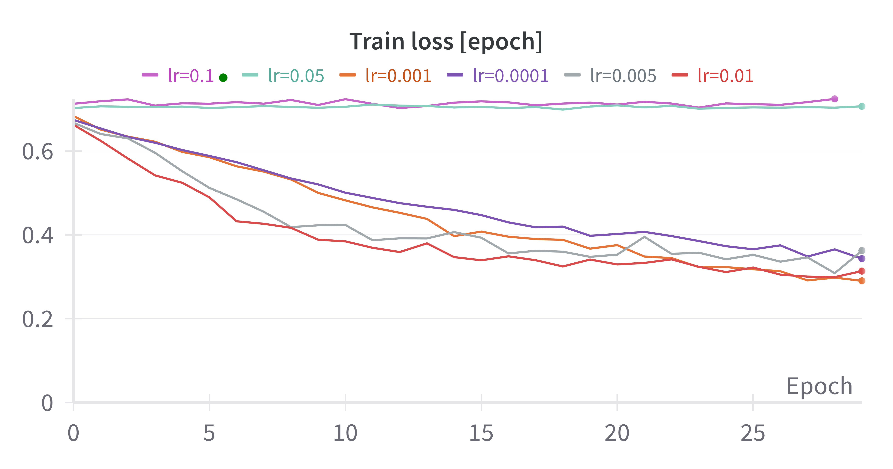
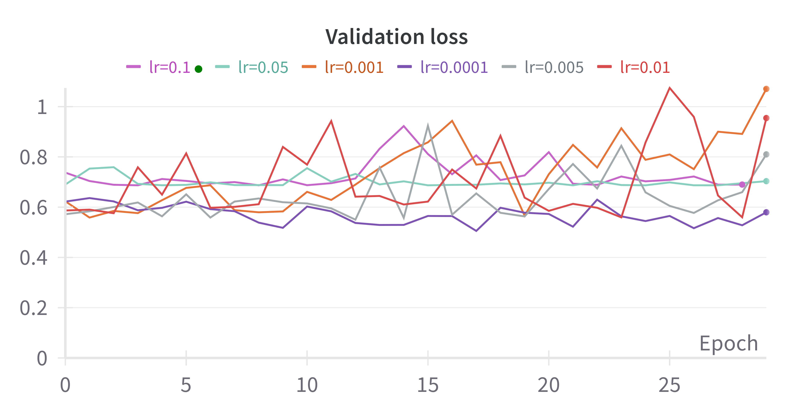
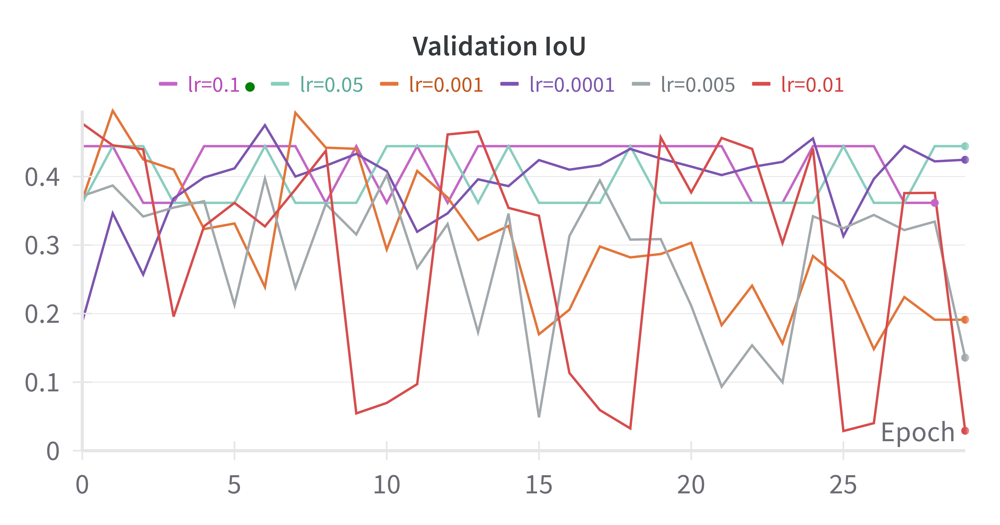

# Zaitra Challenge

## Table of contents
1. [Introduction](#introduction)
2. [Dataset](#dataset)
3. [Model](#model)
4. [Training](#training)
5. [Evaluation & Results](#evaluation-and-results)
6. [How to run](#how-to-run)

## Introduction
The assignment is to train a segmentation model to segment clouds from the publicly available [Sentinel-2 Cloud Mask Catalogue](https://zenodo.org/records/4172871).

## Dataset
### General information
The dataset consists of 513 [1022x1022] pixel sub-scenes, annotated to three classes CLEAR, CLOUD, CLOUD_SHADOW, however in this challenge, I will focus on the classes CLEAR and CLOUD and consider CLOUD_SHADOW as CLEAR.

### Dataloading and Augmentations
Since the input of the model should be of size [224x224], we will tile the raw scenes into (overlapping) patches of the desired size. We choose 30px as the amount of overlap, because without any overlap, we would be left with  We apply random geometric augmentations (horizontal/vertical flip, rotation) to the patches to reduce the redundancy of the information created by the overlap between the patches. Using no overlap -> we would loose 125*125 pixels worth of information . Thus, if we use an overlap of 30 pixels, we can reduce the amount of informtation lost and get 25 instead of 16 patches.

## Model
At first, I implemented the DeepLabv3 segmentation model with a MobileNet backbone, because it is a relatively small model that I have trained and deployed on hardware before. However, after some initial tests, I was not satisfied with the results and decided to implement a UNET, because UNETs are known to perform very well on segmentation tasks. I tried using a pretrained ResNet34 as the encoder but eventually ended up with just a simple UNET from scratch (I used the implementation from [this kaggle notebook](https://www.kaggle.com/code/cordmaur/38-cloud-simple-unet)). All three models can be found in the [model.py](scripts/model.py). An illustration of the UNET architecture can be seen here:

##  Training
For training the model, I chose a batch size of one, which resulted in an effective batch size of 25 after patchifying the input  image  into patches of [244x224] with an overlap of 30 pixels. For the loss, cross entropy was used and the weights are updated by an Adam optimizer with different learning rates ([0.1,0.05,0.01,0.005,0.001,0.0001]). All of the parameters necessary for training the model can be adjusted in the [config.yaml](config/config.yaml). The best model is chosen by the validation loss and IoU.

## Evaluation and results
For evaluating the model, we implemented the pixel-wise accuracy and the intersection over union (IoU) metric. The table below shows the results of the training runs:

|           | Loss     | Accuracy | IoU      | 
| --------- | -------- | -------- | -------- | 
| lr=0.1    | 0.69     | 0.56     | 0.38     | 
| lr=0.05   | 0.70     | 0.44     | **0.44** | 
| lr=0.01   | 0.95     | 0.55     | 0.03     | 
| lr=0.005  | 0.81     | 0.59     | 0.14     | 
| lr=0.001  | 1.07     | 0.53     | 0.19     | 
| lr=0.0001 | **0.57** | **0.67** | 0.42     | 

Additionally, the plots below show the loss curves and the validation IoU for the different learning rates:

  
  
   

## How to run
### Environment
To set up the environment, create a virutal environment and install the requirmenets with the following commands:

    python -m venv venv
    source venv/bin/activate
    pip install -r  requirements.txt

### Dataset
Download the dataset from [Sentinel-2 Cloud Mask Catalogue](https://zenodo.org/records/4172871) and change the *dataset.params.data_folder* paramter in the [config.yaml](config/config.yaml) to the directory where you saved the dataset (this  directory should contain two separate folders for the masks and the satellite images).

### WandB
If you want to log the results with [WandB](https://wandb.ai/site) and haven't logged into WandB yet, first create an account on their website and then type

    wandb login

in the command line. You will have to enter the API key that is specified on the website. Now you are ready to use WandB! If you don't want to log the training process, simply deactivate it in the [config](config/config.yaml) by setting *wandb.enable* to *False*.

### Training
Before running the training, make sure the configuration is as you want it in the [config](config/config.yaml). It helps to choose a descriptive name for the training run under *wandb.run_name*. Once you are ready, simply run:

    python main.py --mode train

The script will start the training loop and save the final validation metrics in a TXT file in a specified output folder. Additionally to the validation metrics the model is saved in ONNX format. If your device has a GPU and PyTorch cuda installed, it will automatically run on the GPU, otherwise it will run on CPU. Note, that the training is very slow on CPU.

### Testing
For testing the model on the test set, simply run:

    python main.py --mode test

### Inference
For running inference on the saved model, please follow the instructions in the JupyterNotebook.

## Resources
- https://zenodo.org/records/4172871
- https://drivendata.co/blog/cloud-cover-benchmark/
- https://www.kaggle.com/code/cordmaur/38-cloud-simple-unet
- https://github.com/cloudsen12/models/tree/master
